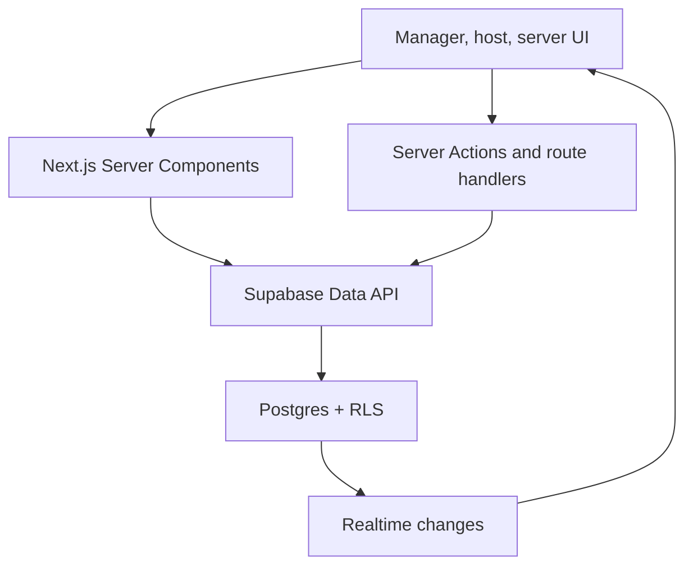
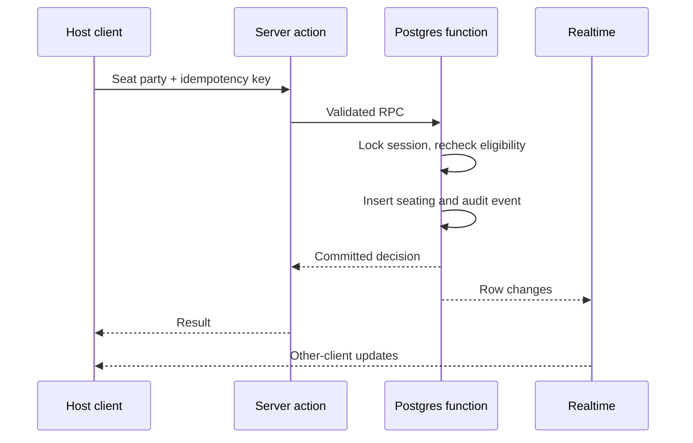

# Architecture

## Shape

ServiceFlow is a modular monolith. One Next.js application owns the user experience and server boundary; one Supabase project owns authentication, relational state, authorization, and realtime events. This is intentionally simpler than microservices for the first restaurant pilot.



## Module boundaries

```text
src/
  app/                  routes, layouts, loading/error boundaries
  components/           shared UI primitives and app shell
  features/
    auth/                passcode rules and capabilities
    schedules/           Morning/Evening/Full Day drafts and views
    allocation/          flexible live rotation board and undo/redo
    tips/                interval splitting and exact cent totals
    floor/               retained pure section-assignment engine
    rotation/            retained pure recommendation engine
  lib/
    supabase/            browser, server, proxy, and admin-only clients
    current-user.ts      authenticated membership hydration
    passcode-security.ts server-only credential locator
  types/                 generated database types and narrow domain types
supabase/
  migrations/            schema source of truth
  tests/                 pgTAP RLS and function tests
```

Features may import from `components`, `lib`, and `types`. A feature does not reach into another feature's internal UI. Shared business concepts move to a narrow public module only after a second real consumer appears.

## Request patterns

### Reads

- Server Components perform initial reads with the authenticated server client.
- Queries select only required columns and filter organization/location early.
- Client subscriptions invalidate or patch the small live floor state; they do not duplicate the entire database.

### Mutations

- A Server Action validates the form with Zod and verifies identity.
- Postgres RLS enforces tenant and role access again.
- Single-table edits use normal Data API mutations.
- Multi-row seating and schedule publishing use transaction-safe database functions.
- The caller supplies an idempotency key for actions that may be retried.

### Passcode sign-in

The route slug identifies the restaurant. The server derives an HMAC locator from the organization ID and numeric passcode, looks up an active credential with the admin client, and then asks Supabase Auth to verify the same passcode against an internal synthetic email. The browser never receives that email, the secret key, or the locator. A request fingerprint limits repeated failures.

### Live seating transaction



The database function is `SECURITY INVOKER`, has an empty search path, is executable only by `authenticated`, and depends on RLS. Transaction-scoped advisory locking serializes decisions for one service session without blocking other restaurants.

## Multi-tenancy and authorization

Every business row carries `organization_id`; location-owned rows also carry `location_id`. Policies use indexed membership lookups. Role checks live in non-exposed helper functions only when a simple indexed `exists` policy is insufficient. UI permission checks improve experience but never replace RLS.

Role order is `owner > general_manager > shift_manager > host > server`; permissions are explicit capabilities rather than string comparisons in application code.

## Time model

- Each location stores an IANA time zone such as `America/Chicago`.
- Shifts store `starts_at` and `ends_at` as `timestamptz`.
- A `service_date` stores the restaurant-local operating date for grouping.
- The app converts at input/output boundaries and never assumes the Vercel or database server time zone.
- Overnight shifts are allowed; `ends_at` must be later than `starts_at`.

## Table assignment and rotation

Section generation and next-server ranking are pure TypeScript functions with deterministic inputs. They are easy to test and preview. The authoritative seating commit re-evaluates eligibility in Postgres to prevent stale clients from double-assigning a turn.

Assignment objectives, in order:

1. keep occupied tables fixed;
2. cover every active table exactly once;
3. minimize imbalance in seat capacity and table count;
4. prefer area continuity;
5. minimize churn from the current assignment.

The first version may use a deterministic greedy allocator. Exact optimization is deferred until pilot data demonstrates a real failure.

The delivered table-allocation board is a smaller append-only operational model: active/paused/removed server columns, numbered rounds, table labels, and actor-stamped board events. A complete active row creates one empty trailing row. In the client, history snapshots power immediate undo/redo; Supabase mode persists equivalent inverse events. Column order (`position`) is manager/owner-reorderable at any time, including mid-round; because entries are keyed by column identity rather than position, reordering only changes who is considered "next" for future turns, never any already-recorded assignment (Feature 010). Any active member may record a table against any column, not only their own — attribution (`assigned_by`) stays real and unspoofable regardless, and a write to someone else's column requires a short, recorded reason (Feature 011). The board is entirely read-only, for every role, once that service date's tip pool is finalized, and reopening it is a manager/owner-only, reason-required action.

## Tip splitting

Managers enter time intervals, a received amount in integer cents, and the people actually on the floor. Each interval is divided independently. Whole cents are assigned equally and deterministic remainder cents go by stable profile-ID order. Aggregated allocations are the only tip rows visible to servers, and each server can select only their own rows. `recalculate_tip_pool` runs as `SECURITY INVOKER` so RLS still applies.

## Deployment architecture

- GitHub feature branch → checks → Vercel preview.
- Supabase branch or local database validates forward migrations.
- Production schema changes use expand/migrate/contract.
- A tested preview is promoted or the merge-to-main deployment is allowed to complete.
- Rollback re-points Vercel only when the schema remains backward compatible.

## Architecture triggers

Reconsider the modular monolith only when one of these is observed: long-running integration jobs, POS webhooks requiring isolated retry queues, cross-region latency that cannot be solved by placement, independently scaled workloads, or team ownership boundaries. Avoid speculative services before those constraints exist.
