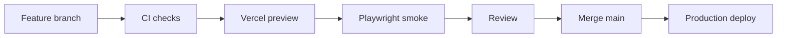

# CI/CD

## Branch flow

Push green, reviewable feature commits—not every file edit. Git remains the history; GitHub Actions and Vercel are the gates.

The generated delivery bundle may have no remote configured. In that case CI files are ready, but no push or Vercel deployment occurs until the owner adds a GitHub remote and project credentials.

## Required checks

- dependency install from lockfile;
- formatting check;
- ESLint;
- TypeScript;
- unit/component tests;
- production build;
- migration and pgTAP checks when `supabase/**` changes;
- Playwright smoke against the preview for critical flows.

## Vercel

Use Vercel's Git integration for branch previews. Protect `main` so the production deployment begins only after required GitHub checks pass. If a custom pipeline is later required, pin Vercel CLI, run `vercel pull`, `vercel build`, test the prebuilt artifact, and `vercel deploy --prebuilt`.

Required CI secrets for a custom Vercel CLI pipeline are `VERCEL_TOKEN`, `VERCEL_ORG_ID`, and `VERCEL_PROJECT_ID`. They are not needed in repository files and must never be committed.

## Database delivery

1. Develop against local Supabase or an isolated branch.
2. Run database tests and advisors.
3. Commit a forward migration and regenerated TypeScript types.
4. Prefer additive/backward-compatible changes.
5. Apply production migration immediately before the compatible application release.
6. Verify a representative query and policy.
7. Remove old schema only in a later release.

Vercel rollback changes the application artifact, not the database. A production migration must therefore remain compatible with the previous application version until rollback risk passes.

## Review automation

The repository includes `.coderabbit.yaml`, but CodeRabbit runs only after its GitHub app is installed for the future repository. Treat its comments as review input, not an approval authority. High-risk authorization, migration, and concurrency changes require human review.

## Release checklist

- All checks green on the exact commit.
- Migration forward and rollback implications understood.
- Environment variable names present in Vercel; values not printed.
- Preview verified at manager desktop, host tablet, and server mobile widths.
- Supabase RLS and performance advisors reviewed.
- Error logging contains no secrets or guest notes.
- Post-deploy smoke test and error scan complete.
