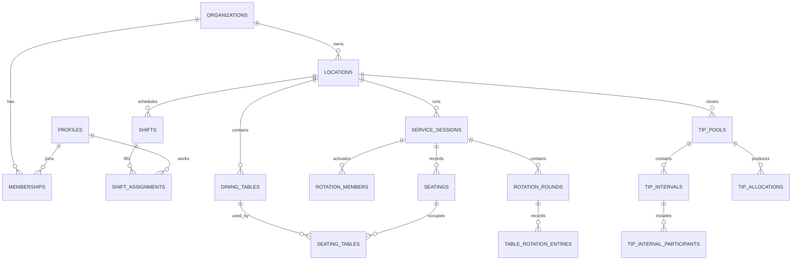

# Data Model and Domain Rules

## Entity map



## Table groups

| Group       | Tables                                                                                                                   | Purpose                                            |
| ----------- | ------------------------------------------------------------------------------------------------------------------------ | -------------------------------------------------- |
| Identity    | `profiles`, `organizations`, `memberships`, `locations`, `passcode_credentials`, `registrations`                         | Tenant, passcode access, people, roles, time zones |
| Scheduling  | `operating_hours`, `shift_kind_defaults`, `schedule_periods`, `shifts`, `shift_assignments`                              | Configurable labels/times and published roster     |
| Allocation  | `service_sessions`, `rotation_members`, `rotation_rounds`, `table_rotation_entries`, `board_events`                      | Flexible live table board and reversible history   |
| Tips        | `tip_pools`, `tip_intervals`, `tip_interval_participants`, `tip_allocations`                                             | Manager inputs and person-private estimates        |
| Legacy core | `dining_areas`, `dining_tables`, `seatings`, `seating_tables`, `audit_events`, `availability_rules`, `time_off_requests` | Section, party, and staffing expansion foundation  |

## Important invariants

- A location belongs to exactly one organization.
- A membership is unique by organization and profile.
- A membership carries one or more explicit roles; role names are not compared by rank.
- A shift is contained in one location and `ends_at > starts_at`.
- One profile is assigned at most once to a shift.
- A dining-table label is unique within a location.
- At most one active service session exists per location and meal period.
- An occupied table is attached to at most one open seating.
- One rotation member exists per service session and server.
- A seating decision and its audit event commit together.
- All manual seating overrides include `override_reason` and `decided_by`.
- A shift kind is exactly `morning`, `evening`, or `full_day`; default times are configurable per location.
- Shift `from date` is required; `to date` and custom start/end are optional. Custom times are supplied as a pair.
- Each active rotation member has at most one entry in a round.
- A standing empty round is kept ready one round ahead of wherever anyone is actually working in the client model, opened the moment the trailing round gets its first value — not once every active column has filled it, which is a per-column-in-effect condition that can never be satisfied on an uneven floor (see the "Table allocation writes" note below). A manager may also append a round on demand.
- Tip calculations use integer cents and always reconcile to the input cents.

## Schedule versions

`schedule_periods` represent a restaurant-local date range and have `draft`, `published`, or `archived` status. `published_version` increases on each publish. Shifts stay editable in a draft; publishing records a snapshot identifier and an audit event. A later change creates a new version rather than rewriting what staff previously saw.

**Feature 015 Phase B — a simplified stand-in for the versioned-period model above**: `schedule-actions.ts`'s `getOrCreateDraftPeriod` creates at most one draft `schedule_periods` row per `(location_id, calendar year)`, not one per publish batch. This is deliberately simpler than the date-range-versioned model described above, chosen because the UI has no period-scoped navigation yet to make finer-grained periods meaningful. The "a later change creates a new version rather than rewriting" invariant is still honored: if the year's most recent period is already published, a fresh draft period is created alongside it rather than reopening the published one. Revisit this once the UI needs to distinguish between periods within the same year.

## Rotation model

`rotation_members` stores current operational state:

- `position`: stable tie-break order;
- `status`: active, paused, closing, or unavailable;
- `party_count` and `cover_count`: committed workload;
- `last_seated_at`: fairness tie-break;
- `max_concurrent_tables`: optional safety limit;
- `active_table_count`: derived/maintained operational count.

The pure recommendation function receives a snapshot and returns a recommended member plus explanation. The commit function locks the service session, re-reads state, rejects stale/ineligible assignments, inserts the seating, updates counters, and appends the audit event.

Default effective workload:

`party_count + (cover_count * cover_weight) + capacity_penalty`

`cover_weight` is a location setting with a documented default. It is configuration, not hard-coded policy.

**Feature 015 Phase C — the delivered allocation board's simpler mapping onto this schema**: the delivered board (`rotation-board.ts`, ARCHITECTURE.md's "Table assignment and rotation" section) is a smaller model than the one above — a `RotationColumn` is a `rotation_members` row, not the richer workload-scored recommendation engine. Its 3-value `ColumnStatus` (`active`/`paused`/`removed`) collapses this table's 4-value `rotation_status` enum: `removed` maps to `unavailable` (the closest existing fit — `closing` has no UI concept yet and nothing in the delivered board writes it). `service_sessions.meal_period` has no delivered-board equivalent (this app doesn't model separate meal periods) and is always the fixed literal `'service'`, the same kind of honest placeholder as Phase B's shift `role_label := 'Server'`. `rotation_members`'s `(service_session_id, position)` uniqueness is `deferrable initially deferred` (Phase C) so a column reorder can swap two positions in one statement — a plain `unique` constraint can't be made deferrable with `alter constraint`; it has to be dropped and recreated deferrable.

## Keys and indexes

- Use `bigint generated always as identity` for internal high-volume records.
- Use UUIDs for externally referenced tenant and configuration entities when stable opaque URLs are useful.
- Index every foreign key.
- Add composite indexes matching dominant filters, for example `(organization_id, location_id, service_date)` and `(service_session_id, status, last_seated_at)`.
- Add partial indexes for open seatings and active sessions.
- Index every column used in an RLS predicate.

## RLS matrix

| Data                  | Owner/GM                | Shift manager           | Host                    | Server                                        |
| --------------------- | ----------------------- | ----------------------- | ----------------------- | --------------------------------------------- |
| Organization settings | Manage                  | Read assigned location  | No                      | No                                            |
| Staff roster draft    | Manage                  | Manage assigned shifts  | Read today              | Own/read published                            |
| Published schedule    | Manage                  | Read                    | Read                    | Read assigned location                        |
| Floor configuration   | Manage                  | Manage                  | Read                    | Read own section                              |
| Live service          | Manage                  | Manage                  | Operate                 | Read own status                               |
| Audit events          | Read                    | Read assigned location  | No                      | No                                            |
| Table allocation rows | Manage (+ reorder/lock) | Manage (+ reorder/lock) | Write any active column | Write any active column                       |
| Tip inputs/totals     | Manage                  | Manage                  | No                      | Own allocation only                           |
| Registrations         | Manage                  | Read                    | No                      | Self-serve via server route                   |
| Payroll (Feature 020) | Manage everyone         | Manage everyone         | No                      | Read own period + own confirmed payments only |

Policies combine `to authenticated` with an indexed membership/location predicate. `to authenticated` by itself is not authorization. Update policies include both `using` and `with check`.

`memberships.roles` is an enum array so one person can operate in more than one restaurant role without duplicating their membership. General managers may manage operational roles but cannot grant, edit, or remove owner/general-manager roles; an owner must do that.

**Designations (Feature 014)**: the UI presents four designations — Owner, Manager, Assistant Manager, Staff — as a label over the existing five-value `roles` array, not a new column or a new permission tier: `owner`→Owner, `general_manager`→Manager, `shift_manager`→Assistant Manager, `host`/`server`→Staff. Manager and Assistant Manager already carry identical operational RLS grants (see the RLS matrix above — `general_manager` and `shift_manager` are grouped together in nearly every policy); the only place they differ is membership-write capability. Who may change whose designation is exactly who may already change whose `roles` row today: an owner is unrestricted; a general manager may toggle a target between `shift_manager` and `server`/`host` as long as the target's current roles don't include `owner` or `general_manager` (per `memberships_update_manager`'s `using` clause) and may never write `owner` or `general_manager` into anyone's roles (per its `with check` clause); a `shift_manager` has no membership-write grant at all, despite full operational access — personnel/HR capability is a separate grant from operational capability. No new RLS policy was added for this feature.

**Table allocation writes (Feature 011, revised twice)**: `table_rotation_entries` is writable by any active member for any column, not only their own — `assigned_by` is still always the caller's own `auth.uid()` and can never be spoofed to attribute an edit to someone else. A write to a column that isn't the actor's own is always attributed (recorded and shown to the whole team); there is no reason field or reason data involved anywhere in this flow (originally shipped as reason-required, made optional as service-time friction, then removed from the UI entirely once testing showed the empty field itself was unwanted — see `docs/features/011-allocation-board-open-editing.md`). Manager-only actions (pause/remove/reorder) keep their own separate manager-scoped policy on `rotation_members`, unaffected by this change. Clear row/column/board and add-row were _not_ actually covered by an equivalent guard until Feature 015 Phase C added one directly inside each RPC (`private.assert_is_board_manager`) — `table_rotation_entries`/`rotation_rounds` had to become writable by any active member for unrelated reasons (undo, the standing-empty-round auto-open), which would otherwise have left those four actions reachable by any active member calling the RPC directly. See `docs/SECURITY.md`'s "Feature 015 Phase C" subsection for the full account of this and the two other gaps the same verification pass found. `rotation_members.position` (Feature 010) is the reorder target: it changes who is "next" for future turns without touching any already-recorded `table_rotation_entries` row, since entries are keyed by `rotation_member_id`, not position. All allocation-board writes are denied — for every role, including owner — once that service date's `tip_pools` row is `finalized`; the reverse transition (`tip_pools_reopen_manager`) is manager/owner-only and requires clearing `finalized_at`/`finalized_by` together with the status change, matching the existing check constraint.

**Standing empty-row trigger, corrected**: the buffer row described above originally opened only once every active column had filled the row before it — in effect a per-column-agreement condition, even though it reads as "the row." On a floor where one or more columns never catch up to the others in any given round, no round ever satisfies that condition, so no new row ever appeared no matter how far ahead the fast columns got. The trigger is now a round's first value, not its last — a per-board signal that work has started, independent of how many (or which) columns have gone.

**Member deactivation (Feature 017)**: no new column — `memberships.active` (already existed) is the enforcement layer, since `private.has_org_role` requires it and nearly every policy in this schema calls that function. Deactivating someone also sets `passcode_credentials.active = false` for the same profile (blocking the locator lookup at sign-in) and bans their Supabase Auth account (`ban_duration`, closing the identity-check gap for an already-open session — see `docs/SECURITY.md`'s Feature 017 subsection for exactly what each of the three layers does and does not cover, confirmed live rather than assumed). Reactivation is the exact symmetric reverse. `getOrganizationRoster` (`src/features/team/data/roster.ts`) now returns inactive members too, not only active ones as before this feature — the Team tab needs to see them to offer Reactivate; every other real-mode consumer (schedule/allocation/tips pickers) filters to active-only itself (`activeTeam` in `restaurant-operations-app.tsx`) so a deactivated person is never offered as a new assignment target elsewhere. **`private.has_org_role` has a second clause, unrelated to this feature but discovered while testing it**, that grants an organization's `created_by` full access regardless of `memberships.active` — see `docs/SECURITY.md`'s Feature 017 subsection for the full account; not fixed by this feature, since `has_org_role` backs nearly every policy in the schema and widening scope to touch it was left as a decision for review, not assumed.

## Tip pool lifecycle (Feature 015 Phase D)

`tip_pools` rows are created lazily, on the first `tip_intervals` insert for a `(location_id, service_date)` — there is no pre-seeded pool waiting for a service date to arrive. `getTipsContext()` returns an empty, all-draft context (`tipPoolId: null`, `status: "estimating"`, no intervals) when no pool exists yet for today; `addTipIntervalAction` creates the pool on demand and returns its id so the client can capture it without a second read.

## PostgREST embed cardinality: two real gotchas, corrected after a production bug

**Ambiguous embeds are rejected outright, not silently resolved.** When a table has two foreign keys to the same target — `shifts` has both `shifts_schedule_period_id_fkey` (plain) and `shifts_period_tenant_fk` (tenant-composite) pointing at `schedule_periods`, and symmetrically `shift_assignments` has two FKs back to `shifts` — a bare embed (`schedule_periods(status)`) returns a `PGRST201` error ("more than one relationship was found"), not rows, not an empty array. The fix is naming the constraint explicitly: `schedule_periods!shifts_period_tenant_fk(status)`. `getScheduleContext()`'s shifts query hit this for real: the query errored on every request, the error was never checked, and the resulting `[]` was indistinguishable from "no shifts exist yet" — real writes looked like they weren't persisting. Caught only by querying the live project directly with the app's exact select string, not by any local test (no test mocks the real Supabase client for this path).

**`isOneToOne: false` in `database.generated.ts` does not mean the embed is array-shaped at runtime.** It means the FK's target column isn't marked unique — which is a different question from whether a given embed direction is to-one or to-many. `memberships.profile_id → profiles.id` (one profile can have several memberships across organizations, so `isOneToOne` is `false`) still returns a **single object** for `profiles(display_name)` when embedded from `memberships`, because that embed follows the FK column that lives on `memberships` itself — many memberships to one profile. Confirmed against the live project: `{"profile_id":"...","profiles":{"display_name":"gk"}}`, not an array. `getOrganizationRoster()` originally indexed this as `row.profiles?.[0]?.display_name` to satisfy the compiler, which reads `undefined` off a real object and silently produced "Unknown" for every registered member. The fix is a type assertion past the incorrect generated type (`row.profiles as unknown as {display_name: string} | null`), not array indexing. The same fix applies to `schedule_periods!shifts_period_tenant_fk(status)` on the `shifts` embed above — also a many-to-one, also mistyped as an array, also fixed the same way.

**Rule of thumb going forward**: a foreign key that lives on the table you're selecting from (the "many" side embedding the "one" side it points at) is always a single object at runtime, regardless of what `isOneToOne` says or what TypeScript infers — verify against the live project with the exact select string before trusting the generated type, the same way both of the bugs above were actually found.

`audit_events.actor_profile_id` has no direct foreign key to `profiles` for the same embedding purpose — its actual FK is a composite `(organization_id, actor_profile_id) → memberships(organization_id, profile_id)`, not a direct reference to `profiles`. Resolving an actor's display name (`getTipsContext()`'s audit log) goes through a `Map` built from an already-fetched roster array instead of a second embedded query.

## Data API exposure

Migrations explicitly grant only the verbs required by the application roles. Grants make a table reachable; RLS limits rows. Both layers are required. Administrative tables that do not need browser access should live in a private schema or have public roles revoked.

`passcode_credentials` and `passcode_login_attempts` have no browser-role policies or grants. The service role is used only inside route handlers. Composite `(id, organization_id)` foreign keys prevent child rows from referencing a record in another tenant.

**Neon attendance data (Feature 018) is outside this data model entirely.** `src/features/attendance/` reads a separate Neon Postgres database (`users`, `attendance`) over a read-only connection — nothing it reads is ever written into any table above, so none of this section's grants/RLS discussion applies to it; see `docs/SECURITY.md`'s Feature 018 subsection for the full account. One real limitation worth recording here: Neon's `users` table has no organization/tenant column, so this integration cannot be scoped per-organization the way every table above is — it assumes a single restaurant uses this deployment, the only reality that exists today.

**`attendance_identity_links` (Feature 019) is the tenant-scoped bridge between the two identity systems.** Each row maps exactly one Supabase membership to exactly one positive Neon `users.id` within an organization. Unique constraints on `(organization_id, profile_id)` and `(organization_id, neon_user_id)` prevent multiple identities in either direction. Composite foreign keys from `(organization_id, profile_id)` and `(organization_id, linked_by)` to `memberships` prevent cross-tenant targets and actors; reverse-order indexes support self-policy and foreign-key lookups. The table stores no Neon attendance rows or credentials. Manager-tier members may manage links, while regular members may select only their own link through RLS.

**Payroll (Feature 020, Phase 1 — schema and RLS only, no application code yet) persists entirely in Supabase, on its own four tables, independent of both Neon and Tip Split.** `payroll_settings` (one row per organization, the default hourly rate) and `payroll_rates` (per-person overrides, keyed by Neon `users.id`) hold only _current_ configuration — never consulted for a month already generated. `payroll_periods` is a frozen snapshot (`hours_snapshot`, `rate_cents_snapshot`, `gross_cents`), one row per `(organization_id, neon_user_id, period_month)`, written once at generation and never recomputed automatically. `payroll_payments` holds every payment recorded against a period; a database trigger (`private.forbid_confirmed_payment_edit`) makes a confirmed payment's `amount_cents`/`payment_date`/`comment` immutable, so a correction is always a new row (`reverses_payment_id`), never a mutation of financial history. Every actor column across all four tables is a composite `(organization_id, profile_id) → memberships` foreign key, and `reverses_payment_id` is a composite self-reference against `payroll_payments (organization_id, id)` — both applied from the start here, the direct lesson from `attendance_identity_links`' own post-apply hardening migration. A regular member's own scope is resolved by joining through `attendance_identity_links` (the same table Feature 019 built), never by a new identity mechanism — see `docs/SECURITY.md`'s Feature 020 subsection for the full policy walkthrough. Money is integer cents throughout (`amount_cents`, `*_cents` columns), matching `tip_intervals.amount_cents` — no dollar-typed or floating-point column anywhere in this schema, and no foreign key or function shared with any `tip_*` table in either direction.

## Generated types

After applying migrations to the linked project:

```bash
npm run db:types
```

Generated output is committed at `src/types/database.generated.ts`. Hand-written domain types may narrow or compose generated shapes but must not duplicate the database schema manually.
