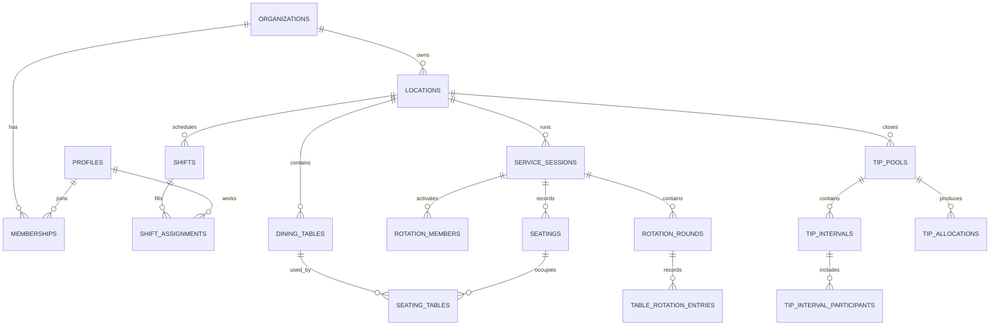

# Data Model and Domain Rules

## Entity map



## Table groups

| Group       | Tables                                                                                                                   | Purpose                                            |
| ----------- | ------------------------------------------------------------------------------------------------------------------------ | -------------------------------------------------- |
| Identity    | `profiles`, `organizations`, `memberships`, `locations`, `passcode_credentials`, `access_requests`                       | Tenant, passcode access, people, roles, time zones |
| Scheduling  | `operating_hours`, `shift_kind_defaults`, `schedule_periods`, `shifts`, `shift_assignments`                              | Configurable labels/times and published roster     |
| Allocation  | `service_sessions`, `rotation_members`, `rotation_rounds`, `table_rotation_entries`, `board_events`                      | Flexible live table board and reversible history   |
| Tips        | `tip_pools`, `tip_intervals`, `tip_interval_participants`, `tip_allocations`                                             | Manager inputs and person-private estimates        |
| Legacy core | `dining_areas`, `dining_tables`, `seatings`, `seating_tables`, `audit_events`, `availability_rules`, `time_off_requests` | Section, party, and staffing expansion foundation  |

## Important invariants

- A location belongs to exactly one organization.
- A membership is unique by organization and profile.
- A membership carries one or more explicit roles; role names are not compared by rank.
- A shift is contained in one location and `ends_at > starts_at`.
- One profile is assigned at most once to a shift.
- A dining-table label is unique within a location.
- At most one active service session exists per location and meal period.
- An occupied table is attached to at most one open seating.
- One rotation member exists per service session and server.
- A seating decision and its audit event commit together.
- All manual seating overrides include `override_reason` and `decided_by`.
- A shift kind is exactly `morning`, `evening`, or `full_day`; default times are configurable per location.
- Shift `from date` is required; `to date` and custom start/end are optional. Custom times are supplied as a pair.
- Each active rotation member has at most one entry in a round.
- A completed active round creates one empty trailing row in the client model.
- Tip calculations use integer cents and always reconcile to the input cents.

## Schedule versions

`schedule_periods` represent a restaurant-local date range and have `draft`, `published`, or `archived` status. `published_version` increases on each publish. Shifts stay editable in a draft; publishing records a snapshot identifier and an audit event. A later change creates a new version rather than rewriting what staff previously saw.

## Rotation model

`rotation_members` stores current operational state:

- `position`: stable tie-break order;
- `status`: active, paused, closing, or unavailable;
- `party_count` and `cover_count`: committed workload;
- `last_seated_at`: fairness tie-break;
- `max_concurrent_tables`: optional safety limit;
- `active_table_count`: derived/maintained operational count.

The pure recommendation function receives a snapshot and returns a recommended member plus explanation. The commit function locks the service session, re-reads state, rejects stale/ineligible assignments, inserts the seating, updates counters, and appends the audit event.

Default effective workload:

`party_count + (cover_count * cover_weight) + capacity_penalty`

`cover_weight` is a location setting with a documented default. It is configuration, not hard-coded policy.

## Keys and indexes

- Use `bigint generated always as identity` for internal high-volume records.
- Use UUIDs for externally referenced tenant and configuration entities when stable opaque URLs are useful.
- Index every foreign key.
- Add composite indexes matching dominant filters, for example `(organization_id, location_id, service_date)` and `(service_session_id, status, last_seated_at)`.
- Add partial indexes for open seatings and active sessions.
- Index every column used in an RLS predicate.

## RLS matrix

| Data                  | Owner/GM | Shift manager          | Host       | Server                  |
| --------------------- | -------- | ---------------------- | ---------- | ----------------------- |
| Organization settings | Manage   | Read assigned location | No         | No                      |
| Staff roster draft    | Manage   | Manage assigned shifts | Read today | Own/read published      |
| Published schedule    | Manage   | Read                   | Read       | Read assigned location  |
| Floor configuration   | Manage   | Manage                 | Read       | Read own section        |
| Live service          | Manage   | Manage                 | Operate    | Read own status         |
| Audit events          | Read     | Read assigned location | No         | No                      |
| Table allocation rows | Manage   | Manage                 | Read       | Write own active column |
| Tip inputs/totals     | Manage   | Manage                 | No         | Own allocation only     |
| Access requests       | Manage   | Review                 | No         | Submit via server route |

Policies combine `to authenticated` with an indexed membership/location predicate. `to authenticated` by itself is not authorization. Update policies include both `using` and `with check`.

`memberships.roles` is an enum array so one person can operate in more than one restaurant role without duplicating their membership. General managers may manage operational roles but cannot grant, edit, or remove owner/general-manager roles; an owner must do that.

## Data API exposure

Migrations explicitly grant only the verbs required by the application roles. Grants make a table reachable; RLS limits rows. Both layers are required. Administrative tables that do not need browser access should live in a private schema or have public roles revoked.

`passcode_credentials` and `passcode_login_attempts` have no browser-role policies or grants. The service role is used only inside route handlers. Composite `(id, organization_id)` foreign keys prevent child rows from referencing a record in another tenant.

## Generated types

After applying migrations to the linked project:

```bash
npm run db:types
```

Generated output is committed at `src/types/database.generated.ts`. Hand-written domain types may narrow or compose generated shapes but must not duplicate the database schema manually.
